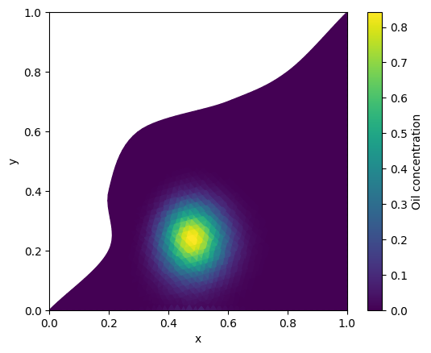

# INF202 Project

### Authors:

Jonas Okkenhaug Bratland (Kabax04)

Tobias Galteland Wåle (Twaale)

Oscar Wiersdalen Thunold (Oggyboggi)

### Introduction

This is an oil spill simulation in a 2D triangular mesh, done as a project for the INF202 course at NMBU.


***Example visualization of oil spill after simulation***

## The Project

### Short description

This is a python program that can:

- read a .msh file
- represent mesh + cells object oriented
- move oil in time via fluxes
- be run with config (.toml)
- log and visualize results

## Usage

### Requirements

To use this project, ensure you have **Python** installed along with the required dependencies listed in `requirements.txt`. You can install the dependencies using pip:

```bash
pip install -r requirements.txt
```

### Running the program

To run the oil spill simulation, execute the main script located in the `src` directory. You can specify configuration options in the `input.toml` file if needed.

```bash
python -m src.main -c input.toml
```
This will run the simulation and generate an image file `final.png` visualizing the oil spill after the simulation, as well as a video file `video.avi` showing the time evolution of the oil spill.

***Warning: The simulation may take several minutes to complete depending on the mesh size and number of time steps.***

## File structure documentation

### Class structure and features (file/Class)

#### mesh/Mesh

The `Mesh` class is responsible for reading and representing a finite element mesh from a file. It uses the `meshio` library to support various mesh formats (such as `.msh`). The class stores mesh point coordinates and constructs cell objects (e.g., `Line`, `Triangle`) for each element in the mesh.

**Key attributes:**
- `points`: NumPy array of mesh point coordinates.
- `cells`: List of cell objects (`Line`, `Triangle`, etc.).

**Key methods:**
- `__init__(filename: str)`: Loads the mesh from the specified file.
- `computeNeighbors()`: Computes and assigns neighboring cells for each cell in the mesh.

The class currently supports line and triangle cells. Other cell types are ignored.

---

#### cells/Cell

The abstract base class for mesh cells. Provides common functionality for all cell types.

**Key attributes:**
- `idx`: Integer index of the cell.
- `point_ids`: List of indices of points that define the cell.
- `neighbors`: List of indices of neighboring cells.

**Key methods:**
- `compute_neighbors(cell_list)`: Finds and stores neighboring cells that share two points.
- `__str__()`: Abstract method for string representation (implemented by subclasses).

---

#### cells/Line

Represents a 1D line cell, inheriting from `Cell`.

**Key attributes:**
- Inherits all attributes from `Cell`.

**Key methods:**
- `__str__()`: Returns a string representation of the line cell.

---

#### cells/Triangle

Represents a 2D triangle cell, inheriting from `Cell`. Computes geometric properties on initialization if point coordinates are provided.

**Key attributes:**
- Inherits all attributes from `Cell`.
- `edge_to_neighbor`: List mapping each triangle edge to the neighboring cell index (or `None` if no neighbor).
- `_points`: Array of point coordinates for the triangle (internal use).

**Key property methods:**
- `x_mid` / `midpoint`: Centroid of the triangle.
- `area`: Area of the triangle.
- `edge_points`: List of tuples with coordinates for each edge.
- `normals`: List of outward normal vectors for each edge, scaled by edge length.
- `velocity`: Prescribed velocity field at the centroid.

**Key methods:**
- `__init__(point_ids, idx, points=None)`: Initializes the triangle and computes its geometric properties if `points` is provided.
- `__str__()`: Returns a string representation of the triangle cell.

**Notes:**
- Accessing geometric properties when `points=None` raises a `RuntimeError`.

---

#### simulation/Simulation

The `Simulation` class manages the time evolution of the oil spill over the mesh using a finite volume method.

**Key attributes:**
- `mesh`: The mesh object containing cells and geometry.
- `dt`: Time step size.
- `u`: NumPy array holding the current solution (oil amount per cell).
- `u_new`: NumPy array for temporary storage of the updated solution.

**Key methods:**
- `__init__(mesh, dt)`: Initializes the simulation with a mesh and time step.
- `step()`: Advances the solution by one time step, updating cell values using fluxes between neighbors.
- `run(t_end, writeFrequency=1)`: Runs the simulation up to `t_end` with optional output frequency.
- `set_initial_state(x_start, sigma2)`: Sets the initial oil distribution, typically as a Gaussian centered at `x_start`.
- `find_fishing_ground_cells()`: Identifies triangle cells in the fishing ground region.
- `oil_in_fishing_ground()`: Computes the total oil in the fishing ground region.

The class enforces boundary conditions by setting line cell values to zero after each step.

---

#### config/Config

The `Config` class reads and validates simulation configuration parameters from a TOML file.

**Key attributes:**
- `mesh_file`: Path to the mesh file.
- `dt`: Time step size.
- `t_end`: End time for the simulation.
- `write_frequency`: (Optional) Frequency for writing output files.
- `log_name`: (Optional) Name of the log file.

**Key methods:**
- `__init__(filename)`: Loads configuration from the specified TOML file and validates required fields.
- `_validate()`: Checks that all required configuration entries are present and valid.

---

### Other files and functions

#### flux.py

Provides functions to compute numerical fluxes between mesh cells for the finite volume method.

**Key functions:**
- `flux(a, b, normal, edge_velocity)`: Computes the upwind flux across an edge based on the direction of the velocity and the values on either side.
- `flux_contribution(u_i, u_ngh, area_i, normal_i_l, edge_velocity_i, edge_velocity_ngh, dt)`: Calculates the contribution of the flux between a cell and its neighbor, averaged over their velocities and scaled by time step and cell area.

---

#### video.py

Creates a video from a sequence of image frames generated during the simulation.

**Key features:**
- Reads PNG images from the `tmp/` directory (e.g., `img_0000.png`, `img_0001.png`, ...).
- Assembles the images into a video file (`video.avi`) using OpenCV.
- Automatically determines the frame size from the first image.
- Raises an error if any expected frame is missing.

This script is typically run after the simulation to visualize the time evolution of the oil spill.

---

#### plotting.py

Provides functionality to visualize the oil distribution on the triangular mesh.

**Key functions:**
- `plot_solution(mesh, u, filename, umin=None, umax=None)`:  
  Plots the oil concentration for each triangle cell in the mesh using a colormap, marks the fishing grounds, and saves the result as an image file.  
  - Adds a colorbar for oil concentration.
  - Draws each triangle colored by oil amount.
  - Highlights the fishing ground region with a red dashed rectangle.

This function is used to generate visual outputs of the simulation at different time steps.

---

***Bratland, Wåle, Thunold***

***NMBU, 2026***